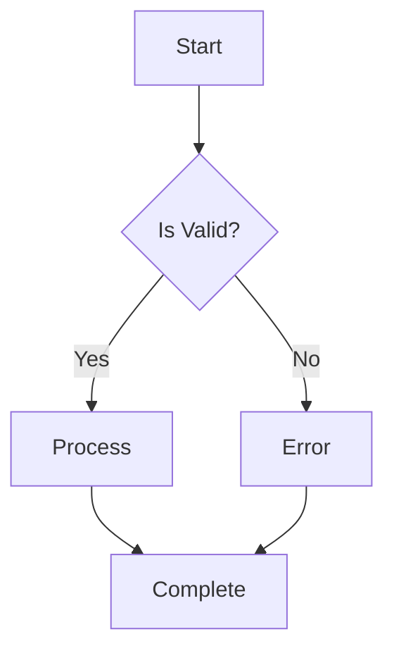
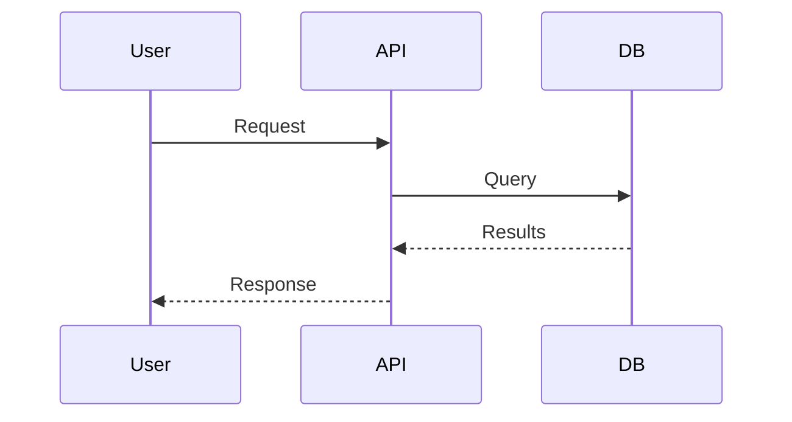
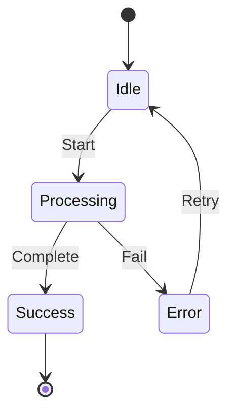
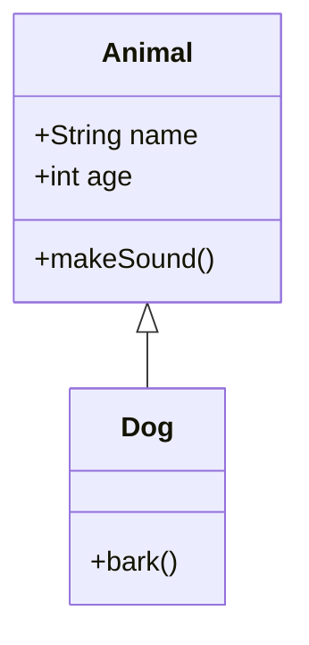
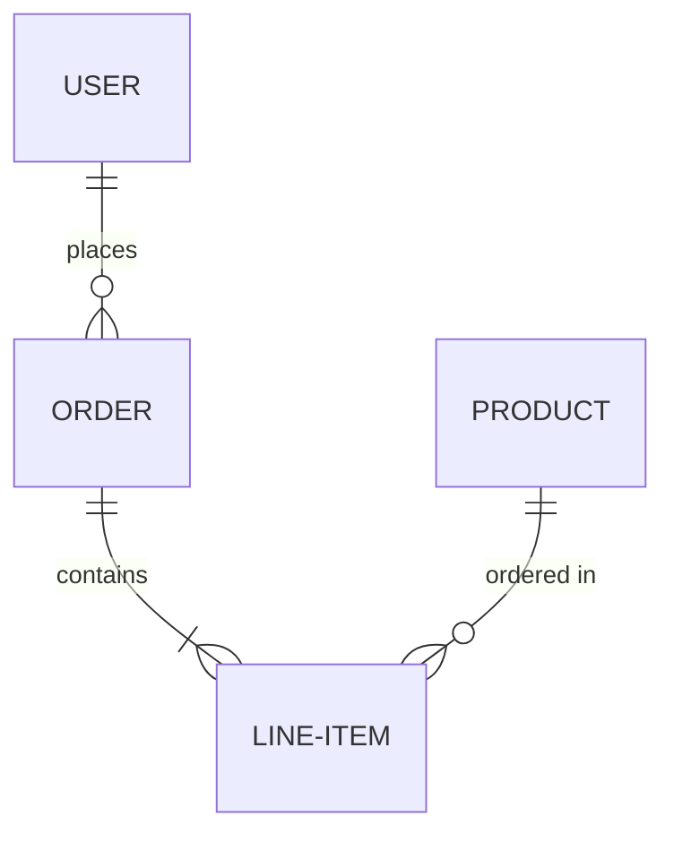

# Beautiful-Mermaid Diagram Rendering

## Overview

Beautiful-mermaid is a TypeScript library that renders Mermaid diagrams as SVG or ASCII/Unicode text with ultra-fast performance, full theming support, and zero DOM dependencies. Perfect for AI-assisted programming and terminal workflows.

## Installation

```bash
npm install beautiful-mermaid
# or
bun add beautiful-mermaid
# or
pnpm add beautiful-mermaid
```

## Supported Diagram Types

- **Flowcharts**: `graph TD`, `graph LR`
- **State Diagrams**: `stateDiagram-v2`
- **Sequence Diagrams**: `sequenceDiagram`
- **Class Diagrams**: `classDiagram`
- **ER Diagrams**: `erDiagram`

## Core APIs

### SVG Rendering (Async)

```typescript
import { renderMermaid } from 'beautiful-mermaid'

// Basic usage with auto-generated colors
const svg = await renderMermaid(`
  graph TD
    A[Start] --> B{Decision}
    B -->|Yes| C[Action]
    B -->|No| D[End]
`)

// Custom colors
const svg = await renderMermaid(diagram, {
  bg: '#1a1b26',
  fg: '#a9b1d6'
})

// Full theme control
const svg = await renderMermaid(diagram, {
  bg: '#0f0f0f',
  fg: '#e0e0e0',
  accent: '#ff6b6b',
  line: '#888888',
  muted: '#666666',
  surface: '#1a1a1a',
  border: '#333333',
  font: 'Inter',
  transparent: false
})
```

### ASCII/Unicode Rendering (Sync)

```typescript
import { renderMermaidAscii } from 'beautiful-mermaid'

// Unicode output (default, prettier)
const text = renderMermaidAscii(`
  graph LR
    A --> B --> C
`)

// Pure ASCII output (maximum compatibility)
const ascii = renderMermaidAscii(diagram, { useAscii: true })

// Custom spacing
const spaced = renderMermaidAscii(diagram, {
  paddingX: 4,
  paddingY: 2,
  boxBorderPadding: 1
})
```

## Theming System

### Two-Color Foundation (Mono Mode)

The library automatically generates a full color palette from just `bg` and `fg` using `color-mix()`:

```typescript
// Minimal theme - everything else auto-generated
const svg = await renderMermaid(diagram, {
  bg: '#FFFFFF',
  fg: '#27272A'
})
```

This derives:
- Text colors at varying opacities
- Node fills and strokes
- Connector and arrow colors
- Secondary and edge label colors

### Enriched Mode

Override specific colors for fine control:

```typescript
const svg = await renderMermaid(diagram, {
  bg: '#1a1b26',      // Background
  fg: '#a9b1d6',      // Primary foreground
  line: '#7aa2f7',    // Lines and connectors
  accent: '#bb9af7',  // Highlights and accents
  muted: '#565f89',   // Secondary text
  surface: '#24283b', // Node backgrounds
  border: '#3b4261'   // Borders
})
```

### Built-in Themes

```typescript
import { renderMermaid, THEMES } from 'beautiful-mermaid'

// Available themes
const themeNames = [
  'zinc-light',
  'zinc-dark',
  'tokyo-night',
  'tokyo-night-storm',
  'tokyo-night-light',
  'catppuccin-latte',
  'catppuccin-frappe',
  'catppuccin-macchiato',
  'catppuccin-mocha',
  'nord',
  'dracula',
  'github-light',
  'github-dark',
  'solarized-light',
  'one-dark'
]

// Use a built-in theme
const svg = await renderMermaid(diagram, THEMES['tokyo-night'])

// Customize a built-in theme
const svg = await renderMermaid(diagram, {
  ...THEMES.nord,
  accent: '#ff6b6b'
})
```

### VS Code Theme Integration (Shiki)

Convert any VS Code theme to diagram colors:

```typescript
import { getSingletonHighlighter } from 'shiki'
import { renderMermaid, fromShikiTheme } from 'beautiful-mermaid'

// Load a Shiki theme
const highlighter = await getSingletonHighlighter({
  themes: ['vitesse-dark', 'min-light', 'catppuccin-mocha']
})

// Convert theme to diagram colors
const colors = fromShikiTheme(highlighter.getTheme('vitesse-dark'))

// Render with editor-matching colors
const svg = await renderMermaid(diagram, colors)
```

### Live Theme Switching

All colors are exposed as CSS custom properties, enabling instant theme changes without re-rendering:

```typescript
// Initial render
const svg = await renderMermaid(diagram, THEMES['github-light'])

// In browser, update CSS variables for instant theme switch
document.documentElement.style.setProperty('--diagram-bg', '#0d1117')
document.documentElement.style.setProperty('--diagram-fg', '#c9d1d9')
// ... etc
```

## Common Usage Patterns

### Pattern: CLI Tool with ASCII Output

```typescript
#!/usr/bin/env node
import { renderMermaidAscii } from 'beautiful-mermaid'
import { readFileSync } from 'fs'

const diagram = readFileSync(process.argv[2], 'utf-8')
console.log(renderMermaidAscii(diagram))
```

### Pattern: Theme Switcher

```typescript
import { renderMermaid, THEMES } from 'beautiful-mermaid'

async function renderWithTheme(diagram: string, themeName: string) {
  const theme = THEMES[themeName] || THEMES['zinc-dark']
  return await renderMermaid(diagram, theme)
}
```

### Pattern: Match System Dark Mode

```typescript
const isDark = window.matchMedia('(prefers-color-scheme: dark)').matches
const theme = isDark ? THEMES['tokyo-night'] : THEMES['github-light']
const svg = await renderMermaid(diagram, theme)
```

### Pattern: Transparent Background for Overlays

```typescript
const svg = await renderMermaid(diagram, {
  ...THEMES.nord,
  transparent: true
})
```

### Pattern: Batch Rendering

```typescript
const diagrams = [/* ... */]

// Parallel rendering (fast!)
const svgs = await Promise.all(
  diagrams.map(d => renderMermaid(d, THEMES['one-dark']))
)

// 100+ diagrams in under 500ms
```

## Options Reference

### SVG Options (`renderMermaid`)

| Option | Type | Default | Description |
|--------|------|---------|-------------|
| `bg` | string | `#FFFFFF` | Background color |
| `fg` | string | `#27272A` | Foreground/text color |
| `line` | string | *auto* | Line and connector color |
| `accent` | string | *auto* | Highlight and accent color |
| `muted` | string | *auto* | Secondary text color |
| `surface` | string | *auto* | Node background color |
| `border` | string | *auto* | Border color |
| `font` | string | `Inter` | Font family |
| `transparent` | boolean | `false` | Transparent background |

### ASCII Options (`renderMermaidAscii`)

| Option | Type | Default | Description |
|--------|------|---------|-------------|
| `useAscii` | boolean | `false` | Use ASCII instead of Unicode |
| `paddingX` | number | `2` | Horizontal spacing between nodes |
| `paddingY` | number | `1` | Vertical spacing between nodes |
| `boxBorderPadding` | number | `1` | Inner padding of boxes |

## Example Diagrams

### Flowchart



### Sequence Diagram



### State Diagram



### Class Diagram



### ER Diagram



## Performance Characteristics

- **Rendering Speed**: 100+ diagrams in under 500ms
- **Dependencies**: Zero DOM dependencies (works in Node.js)
- **Synchronous**: ASCII rendering is fully synchronous
- **Bundle Size**: Lightweight pure TypeScript implementation

## Debugging

### Common Issues

**1. Mermaid syntax errors**: The library does not validate syntax. Use the official Mermaid Live Editor first to verify diagram syntax.

**2. Missing fonts**: SVG uses `Inter` by default. Override with `font` option if needed.

**3. Colors not showing**: Ensure you're passing hex colors (e.g., `#1a1b26`, not `rgb(26, 27, 38)`).

**4. ASCII output too narrow**: Increase `paddingX` and `boxBorderPadding`.

### Testing Diagrams

```typescript
// Quick test in Node.js REPL
import { renderMermaidAscii } from 'beautiful-mermaid'
console.log(renderMermaidAscii('graph LR; A --> B'))
```

## Integration Patterns

### With Express.js

```typescript
app.post('/render', async (req, res) => {
  const { diagram, theme } = req.body
  const svg = await renderMermaid(diagram, THEMES[theme])
  res.type('image/svg+xml').send(svg)
})
```

### With CLI (Fish Shell)

```fish
#!/usr/bin/env fish

# Render Mermaid file to ASCII
function mmd-ascii
    node -e "
        import('beautiful-mermaid').then(({ renderMermaidAscii }) => {
            const fs = require('fs')
            const diagram = fs.readFileSync('$argv[1]', 'utf-8')
            console.log(renderMermaidAscii(diagram))
        })
    "
end

# Usage: mmd-ascii diagram.mmd
```

### With File Watcher

```typescript
import { watch } from 'fs'
import { renderMermaid, THEMES } from 'beautiful-mermaid'

watch('diagram.mmd', async (event, filename) => {
  const diagram = readFileSync(filename, 'utf-8')
  const svg = await renderMermaid(diagram, THEMES['tokyo-night'])
  writeFileSync('output.svg', svg)
})
```

## Resources

- **Repository**: https://github.com/lukilabs/beautiful-mermaid
- **NPM Package**: https://www.npmjs.com/package/beautiful-mermaid
- **Mermaid Docs**: https://mermaid.js.org/
- **ASCII Engine Credit**: Ported from Alexander Grooff's mermaid-ascii (Go)

## Quick Reference

```typescript
// Import
import { renderMermaid, renderMermaidAscii, THEMES, fromShikiTheme } from 'beautiful-mermaid'

// SVG (async)
await renderMermaid(diagram, { bg: '#000', fg: '#fff' })
await renderMermaid(diagram, THEMES['tokyo-night'])

// ASCII (sync)
renderMermaidAscii(diagram)
renderMermaidAscii(diagram, { useAscii: true })

// Shiki integration
const colors = fromShikiTheme(shikiTheme)
await renderMermaid(diagram, colors)
```
