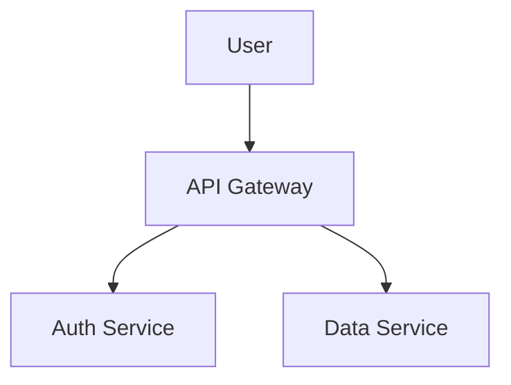

# GitHub README

Use this skill to produce a README that helps visitors decide quickly whether to use the project and how to get started.

## Goal

A good GitHub README should answer, in order:

1. What is this project?
2. Why should I use it?
3. How do I run it right now?
4. How do I configure common cases?
5. How do I contribute?

## Workflow

1. Identify audience and primary use case.
2. Write a short value-first opening section.
3. Add a runnable quickstart with copy-pastable commands.
4. Add usage examples for the 1–3 most common tasks.
5. Add configuration/reference sections only after core onboarding is complete.
6. Add contributor guidance or link to `CONTRIBUTING.md`.
7. Run the README audit script and fix failures.
8. If prose still feels dense, apply the `readability` skill afterward.

## Suggested section order

Use this order by default (adapt as needed):

- Project name
- Short value proposition
- Features / capabilities
- Installation
- Quickstart / usage
- Configuration (if applicable)
- Development / testing
- Contributing
- License

## Style constraints

- Prefer concrete examples over abstract claims.
- Keep setup commands in fenced code blocks.
- Keep each section focused on one user question.
- Avoid burying setup steps deep in prose.
- Use relative links for in-repo docs.

## Audit script

Run the bundled checker:

```bash
ruby scripts/github_readme_audit.rb README.md
```

Strict mode (stronger section expectations):

```bash
ruby scripts/github_readme_audit.rb README.md --strict
```

The script checks for:

- H1 presence
- Core onboarding sections (installation, usage/quickstart)
- License section
- Command code blocks for setup/use
- Intro length guardrail
- Optional table-of-contents reminder on very long files

## Output expectations

When using this skill for a user task:

1. Return the revised README content.
2. Summarize what changed in onboarding flow.
3. Note any missing information that requires user input (for example, deployment steps or support policy).

## Advanced GFM features

GitHub Flavored Markdown supports several features beyond standard markdown. Use these where they add genuine value.

### `<kbd>` — keyboard shortcuts

Renders as styled raised key caps. Use in keybinding tables and setup instructions.

```markdown
Press <kbd>Cmd</kbd> + <kbd>Shift</kbd> + <kbd>P</kbd> to open the palette.

| Action | Mac | Linux |
|--------|-----|-------|
| Save | <kbd>Cmd</kbd> + <kbd>S</kbd> | <kbd>Ctrl</kbd> + <kbd>S</kbd> |
```

### `<details>` / `<summary>` — collapsible sections

Use for long configuration references, changelogs, or optional deep-dives that would otherwise bulk up the top of the README. Put a blank line before markdown content inside `<details>` for it to render correctly.

```markdown
<details>
<summary>Advanced configuration options</summary>

| Option | Default | Description |
|--------|---------|-------------|
| `timeout` | `30` | Request timeout in seconds |

</details>
```

### Mermaid diagrams

Use for architecture overviews, flow charts, sequence diagrams, ER diagrams, and Gantt charts. Renders as SVG inline.

````markdown

````

### GeoJSON / TopoJSON maps

Renders an interactive Leaflet map. Useful for projects with a geographic component. Works both as a fenced block in a `.md` file and when browsing a `.geojson` file directly in GitHub.

````markdown
```geojson
{
  "type": "FeatureCollection",
  "features": [
    {
      "type": "Feature",
      "geometry": { "type": "Point", "coordinates": [-122.4194, 37.7749] },
      "properties": { "name": "San Francisco" }
    }
  ]
}
```
````

### STL models

Renders an interactive 3D WebGL viewer. ASCII STL only for fenced blocks; binary `.stl` files also render when browsed on GitHub. Useful for hardware/electronics projects.

````markdown
```stl
solid cube
  facet normal 0 0 -1
    outer loop
      vertex 0 0 0
      vertex 1 0 0
      vertex 1 1 0
    endloop
  endfacet
endsolid cube
```
````

### SVG `<foreignObject>` — CSS animations

GitHub strips `<style>` tags from markdown but renders ``. SVGs can contain `<foreignObject>` wrapping XHTML+CSS, enabling `@keyframes` animations, `prefers-color-scheme` media queries, and custom fonts. Embed images inside the SVG as base64 data URIs (external loads are blocked by CSP).

```xml
<!-- animation.svg -->
<svg xmlns="http://www.w3.org/2000/svg" width="400" height="80">
  <foreignObject width="400" height="80">
    <body xmlns="http://www.w3.org/1999/xhtml">
      <style>
        @keyframes fade { 0%,100% { opacity:1 } 50% { opacity:0.3 } }
        .t { font-family: monospace; animation: fade 2s infinite; }
      </style>
      <div class="t">animated text</div>
    </body>
  </foreignObject>
</svg>
```

Combine with `<picture>` for dark/light mode variants:

```html
<picture>
  <source media="(prefers-color-scheme: dark)" srcset="header-dark.svg">
  <source media="(prefers-color-scheme: light)" srcset="header-light.svg">
  
</picture>
```

### Color model swatches

Wrapping a color value in backticks renders a small color swatch preview next to it when GitHub detects the format. Supported in issues and PRs (rendering may vary in READMEs).

Supported formats: `` `#ffffff` `` `` `rgb(255, 255, 255)` `` `` `hsl(0, 0%, 100%)` ``

### Alerts

Callout blocks for notes, warnings, and tips. Use sparingly — one or two per README max.

```markdown
> [!NOTE]
> Useful information the reader should know.

> [!TIP]
> Helpful advice for doing things better.

> [!IMPORTANT]
> Key information users need to succeed.

> [!WARNING]
> Urgent info that needs immediate attention.

> [!CAUTION]
> Advises about risks or negative outcomes.
```
