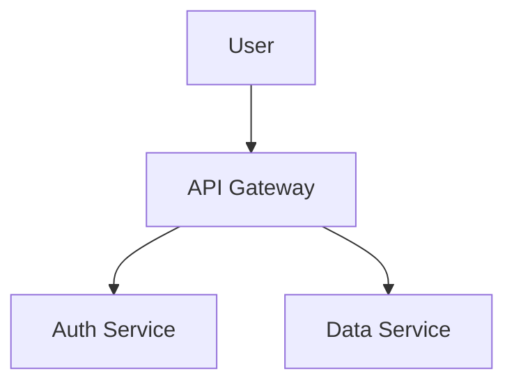

# Advanced GitHub Flavored Markdown
- Core onboarding sections (installation, usage/quickstart)
- License section
- Command code blocks for setup/use
- Intro length guardrail
- Optional table-of-contents reminder on very long files

## Output expectations

When using this skill for a user task:

1. Return the revised README content.
2. Summarize what changed in onboarding flow.
3. Note any missing information that requires user input (for example, deployment steps or support policy).

## Advanced GFM features

GitHub Flavored Markdown supports several features beyond standard markdown. Use these where they add genuine value.

### `<kbd>` — keyboard shortcuts

Renders as styled raised key caps. Use in keybinding tables and setup instructions.

```markdown
Press <kbd>Cmd</kbd> + <kbd>Shift</kbd> + <kbd>P</kbd> to open the palette.

| Action | Mac | Linux |
|--------|-----|-------|
| Save | <kbd>Cmd</kbd> + <kbd>S</kbd> | <kbd>Ctrl</kbd> + <kbd>S</kbd> |
```

### `<details>` / `<summary>` — collapsible sections

Use for long configuration references, changelogs, or optional deep-dives that would otherwise bulk up the top of the README. Put a blank line before markdown content inside `<details>` for it to render correctly.

```markdown
<details>
<summary>Advanced configuration options</summary>

| Option | Default | Description |
|--------|---------|-------------|
| `timeout` | `30` | Request timeout in seconds |

</details>
```

### Mermaid diagrams

Use for architecture overviews, flow charts, sequence diagrams, ER diagrams, and Gantt charts. Renders as SVG inline.

````markdown

````

### GeoJSON / TopoJSON maps

Renders an interactive Leaflet map. Useful for projects with a geographic component. Works both as a fenced block in a `.md` file and when browsing a `.geojson` file directly in GitHub.

````markdown
```geojson
{
  "type": "FeatureCollection",
  "features": [
    {
      "type": "Feature",
      "geometry": { "type": "Point", "coordinates": [-122.4194, 37.7749] },
      "properties": { "name": "San Francisco" }
    }
  ]
}
```
````
